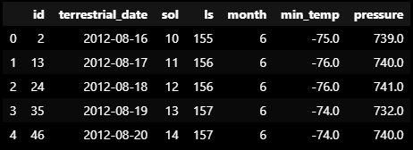

# Mars Data Analysis with Web Scraping

## Introduction
This project integrates meticulous automated browsing and precise data extraction techniques to compile datasets on Mars news articles and weather patterns. Leveraging a comprehensive web-scraping and data analysis tool featuring Splinter and Beautiful Soup, core skills such as data collection, organization, analysis, and visualizations are applied. The process involves identifying HTML elements and their attributes, utilizing this knowledge to automate browsing with Splinter, and parsing HTML with Beautiful Soup. The resulting analysis displays visualizations on the insights collected.

### Part 1: Scrape Titles and Preview Text from Mars News

Import Splinter and BeautifulSoup

    from splinter import Browser
    from bs4 import BeautifulSoup as soup
    from selenium.webdriver.chrome.service import Service
    from webdriver_manager.chrome import ChromeDriverManager

Utilize automated browsing to navigate the Mars news site.

    browser = Browser('chrome')
    url = 'https://static.bc-edx.com/data/web/mars_news/index.html'
    browser.visit(url)

Employ Beautiful Soup to extract pertinent text elements.

    html = browser.html
    soup = soup(html, 'html.parser')

Extract all the title text elements

    title = soup.find_all('div', class_ = "content_title")
    titles = [t.text for t in title]

Extract all the preview text elements

    preview = soup.find_all('div', class_ = "article_teaser_body")
    previews = [p.text for p in preview]

Store extracted data in a Python dictionary

    t_p_list = []
    articles_tp = soup.find_all('div', class_ = "list_text")

    for x in articles_tp:
        # Extract the title and preview text from the elements
        l = x.find('div',  class_ = "list_date").text
        t = x.find('div', class_ = "content_title").text
        p = x.find('div', class_ = "article_teaser_body").text
        
        # Store each title and preview pair in a dictionary
        tp = {"list date" : l, "title" : t, "preview" : p}
        # Add the dictionary to the list
        t_p_list.append(tp)

    browser.quit()

### Part 2: Scrape and Analyze Mars Weather Data

Import relevant libraries

    from splinter import Browser
    from bs4 import BeautifulSoup as soup
    import matplotlib.pyplot as plt
    import pandas as pd

Automate browsing to the Mars Temperature Data Site.

    browser = Browser('chrome')
    url = "https://static.bc-edx.com/data/web/mars_facts/temperature.html"
    browser.visit(url)

Employ Beautiful Soup to scrape data from the HTML table.

    html = browser.html
    soup = soup(html, 'html.parser')
    table = soup.find('table', class_ = 'table')

Assemble scraped data into a Pandas DataFrame with appropriate data types.

(Web scraping with splinter and beatifulsoup used)

    columns = []
    info = []

    header = table.find_all('th')
    for h in header:
        columns.append(h.text)

    data = table.find_all('tr', class_ = 'data-row')

    for d in data:
    input = d.find_all('td')
    info.append(
        [i.text for i in input])

    data_df = pd.DataFrame.from_records(info, columns=columns)
    data_df.head()

(Pandas pd.read_html() funtion used)

    table_rd_df = pd.read_html('https://static.bc-edx.com/data/web/mars_facts/temperature.html')

    mars_df = table_rd_df[0]
    mars_df.head()

Analyze the dataset to answer specific questions and visualize insights.

1. How many months are there on Mars?

2. How many Martian days' worth of data are there?

3. What is the average low temperature by month?

Plot the average temperature by month

4. Average pressure by Martian month

Plot the average pressure by month

5. How many terrestrial (earth) days are there in a Martian year? Plot

Export the DataFrame to a CSV file.

### Conclusion
On average, the third month has the coldest minimum temperature on Mars, and the eighth month is the warmest. But it is always very cold there in human terms! Atmospheric pressure is, on average, lowest in the sixth month and highest in the ninth. The distance from peak to peak is roughly 1425-750, or 675 days. A year on Mars appears to be about 675 days from the plot. Internet search confirms that a Mars year is equivalent to 687 earth days.

### In part 2, dataframes were created with both methods:
- 1. "Web scraping with splinter and beatifulsoup used" = data_df
- 2. "Pandas pd.read_html() funtion used" = mars_df 
- 3.  Second method, mars_df, was used for the analysis portion

### References:

* Used function ".from_records()" to add the table info, which was an output of list of tuples, into the Pandas dataframe:
    * https://pandas.pydata.org/pandas-docs/version/0.19/generated/pandas.DataFrame.from_records.html 
    * https://www.studytonight.com/pandas/pandas-dataframe-from_records-method